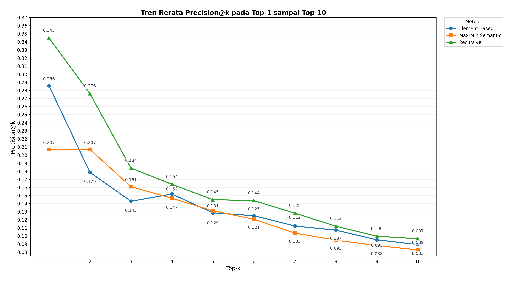
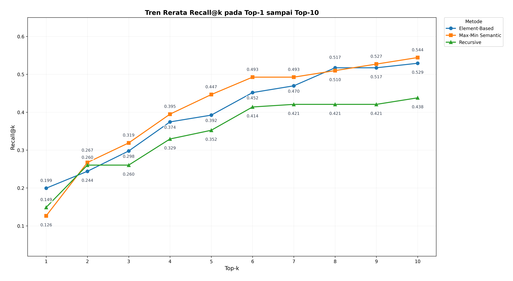
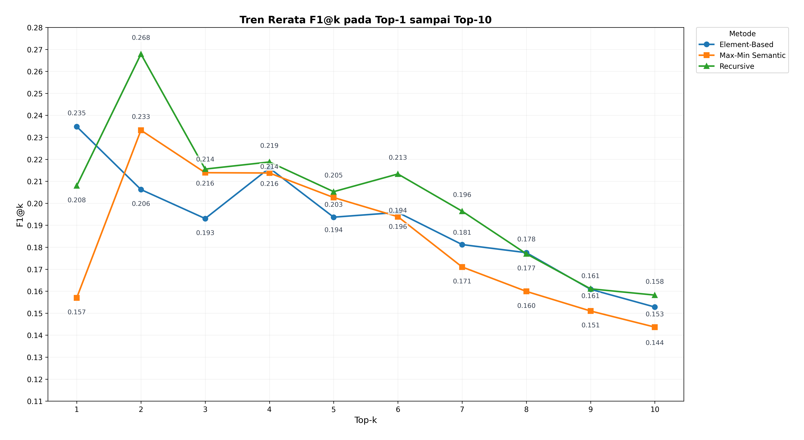
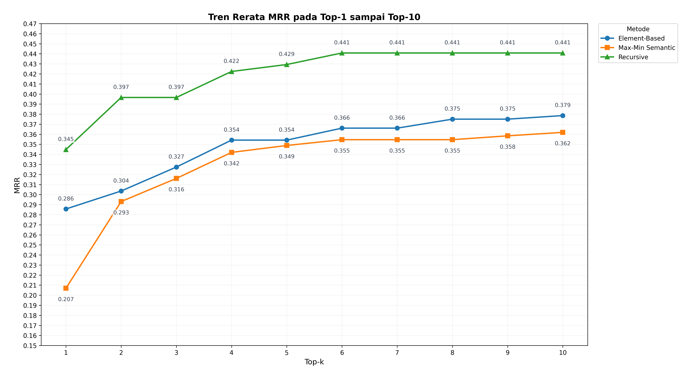
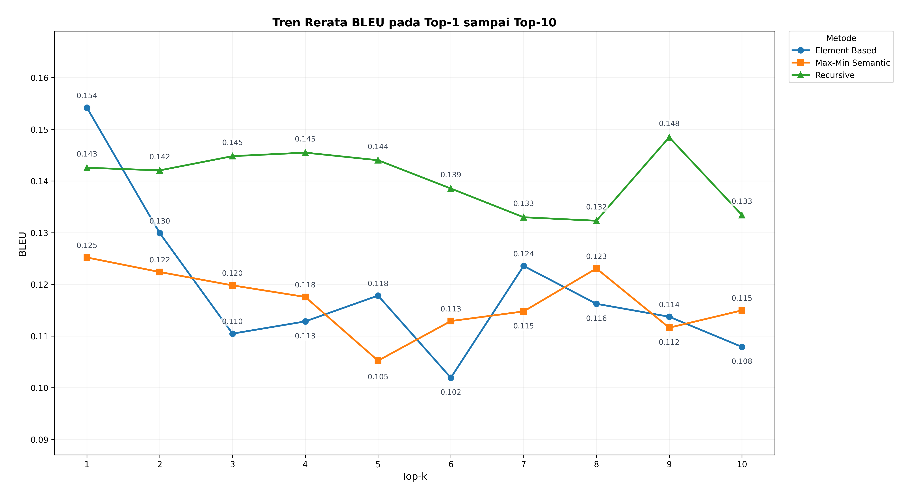
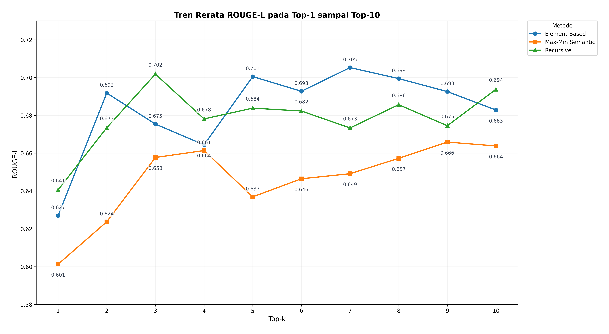

# RAG Skripsi

Sistem Retrieval-Augmented Generation untuk membandingkan tiga metode chunking
dokumen statistik BPS:

- `element_based`
- `maxmin_semantic`
- `recursive`

Pipeline menggunakan Qwen3 untuk embedding dan generation, ChromaDB sebagai
vector store, serta metrik retrieval dan generation untuk evaluasi 30 pasangan
pertanyaan-jawaban.

## Status Project

- Workflow aktif dijalankan langsung dengan Python di laptop atau Vast.ai.
- Docker bukan bagian dari workflow repository terbaru.
- `src/streamlit/rag_chat.py` menyediakan chat, perbandingan tiga metode, dan
  batch evaluation dengan metrik latency.
- Hasil evaluasi terbaru yang tersimpan di repository mencakup full evaluation
  Top-1 sampai Top-10 pada 30 QA dan tiga metode.
- Model, embedding, dan ChromaDB merupakan asset runtime dan tidak disimpan di
  Git.

## Persiapan Environment

Jalankan command dari root repository. Python yang digunakan untuk project ini
adalah Python 3.11.9.

```bash
python -m venv .venv
```

Aktifkan virtual environment sesuai sistem operasi, lalu install dependency:

```bash
pip install -r requirements.txt
```

Notebook visualisasi memerlukan dependency tambahan:

```bash
pip install matplotlib seaborn
```

GPU NVIDIA direkomendasikan untuk embedding dan generation. `llama-cpp-python`
digunakan untuk backend GGUF dan mungkin memerlukan instalasi dengan dukungan
CUDA sesuai environment mesin.

## Asset Runtime

Asset besar disiapkan dengan downloader berikut. Downloader hanya menggunakan
standard library Python, mendukung download paralel, resume melalui file
`.part`, dan dapat dijalankan ulang pada volume persisten.

```bash
# Semua asset: models/, data/chroma/, dan data/embeddings/
python scripts/download_vast_assets.py

# Satu kelompok asset
python scripts/download_vast_assets.py --asset models
python scripts/download_vast_assets.py --asset chroma
python scripts/download_vast_assets.py --asset embeddings

# Periksa rencana download tanpa menulis file
python scripts/download_vast_assets.py --asset all --dry-run
```

Ground truth yang diperlukan untuk evaluasi berada di:

- `data/ground_truth/qa_gold_standard_rag_bps_30qa_question_newest.xlsx`
- `data/ground_truth/qa_pairs_binary.json`
- `data/ground_truth/retrieval_labels_final.csv`

## Alur Data

```text
data/raw/                 PDF mentah
    -> data/cleaned/      teks hasil ekstraksi dan cleaning
    -> data/chunked/      chunk per metode
    -> data/embeddings/   embedding per metode
    -> data/chroma/       collection ChromaDB
    -> results/           hasil evaluasi dan log
```

### 1. Preprocessing

Gunakan `data/cleaned` secara eksplisit agar sesuai dengan input default
chunker MaxMin dan recursive.

```bash
python -m src.preprocessing.pipeline --input data/raw --output data/cleaned
```

### 2. Chunking

```bash
python src/chunking/element_based.py \
  --input data/raw \
  --output data/chunked/element_based

python src/chunking/maxmin_chunker.py \
  --input data/cleaned \
  --output data/chunked/maxmin_semantic \
  --gguf models/Qwen3-Embedding-4B-Q8_0.gguf

python src/chunking/recursive_split.py \
  --input data/cleaned \
  --output data/chunked/recursive
```

### 3. Embedding dan ChromaDB

Mode GGUF direkomendasikan untuk workflow Vast.ai dengan asset yang disiapkan
downloader.

```bash
python -m src.embedding.embed_chunks \
  --mode gguf \
  --gguf-model models/Qwen3-Embedding-4B-Q8_0.gguf \
  --input data/chunked \
  --output data/embeddings

python scripts/load_embeddings_to_chroma.py
```

`load_embeddings_to_chroma.py` me-reset collection yang memiliki file embedding
untuk diproses, lalu memuat collection `element_based`, `maxmin_semantic`, dan
`recursive` ke `data/chroma`.

## Evaluasi

### Retrieval

Standalone retrieval evaluation menghitung Precision@k, Recall@k, dan MRR per
query serta summary CSV.

```bash
python scripts/run_retrieval_eval.py \
  --mode gguf \
  --embedder models/Qwen3-Embedding-4B-Q8_0.gguf \
  --chroma_path data/chroma \
  --top_k 8
```

Output default:

- `results/retrieval_eval.csv`
- `results/retrieval_eval_summary.csv`

### Generation dan Latency

Standalone batch evaluation membaca 30 QA, menjalankan tiga metode, dan
membatasi rentang Top-k ke Top-1 sampai Top-10.

```bash
python scripts/run_generation_eval.py \
  --mode_tag full \
  --top_k_min 1 \
  --top_k_max 10 \
  --resume
```

Mode cepat hanya memakai lima QA stabil:

```bash
python scripts/run_generation_eval.py \
  --mode_tag quick \
  --top_k 1
```

Output disimpan di `results/final/generation/`, berupa CSV per Top-k, summary
CSV, dan log run. Kolom utama meliputi:

- Retrieval: `precision_at_k`, `recall_at_k`, `mrr`, `f1_at_k`
- Generation: `bleu`, `rouge_l_recall`
- Latency: `retrieval_seconds`, `generation_seconds`,
  `total_response_seconds`
- Metadata: `hardware_info`, `error`, dan jumlah query yang berhasil/timed

Summary menghitung mean, median, dan standard deviation latency per metode dan
Top-k. File Top-11 sampai Top-20 yang masih ada merupakan artefak historis dari
workflow Streamlit; standalone script saat ini hanya menerima Top-1 sampai
Top-10.

## Visual Results

Gambar berikut adalah output notebook
`notebooks/eval_analysis_top1_10.ipynb`, menggunakan basis analisis Top-1 sampai
Top-10. Ringkasan angka lengkap tersedia di
`results/final/analysis10/top1_10_metric_summary_by_method.csv`.

<table>
  <tr>
    <td width="50%">
      <a href="results/final/analysis10/figures/precision_at_k_top1_10.png">
        
      </a>
    </td>
    <td width="50%">
      <a href="results/final/analysis10/figures/recall_at_k_top1_10.png">
        
      </a>
    </td>
  </tr>
  <tr>
    <td width="50%">
      <a href="results/final/analysis10/figures/f1_at_k_top1_10.png">
        
      </a>
    </td>
    <td width="50%">
      <a href="results/final/analysis10/figures/mrr_top1_10.png">
        
      </a>
    </td>
  </tr>
  <tr>
    <td width="50%">
      <a href="results/final/analysis10/figures/bleu_top1_10.png">
        
      </a>
    </td>
    <td width="50%">
      <a href="results/final/analysis10/figures/rouge_l_top1_10.png">
        
      </a>
    </td>
  </tr>
</table>

Ringkasan deskriptifnya:

- Recursive unggul pada Precision@k, MRR, F1@k, dan BLEU.
- Max-Min Semantic unggul pada Recall@k.
- Element-Based unggul pada ROUGE-L.

## Streamlit

### RAG Chat dan Batch Evaluation

```bash
streamlit run src/streamlit/rag_chat.py
```

Fitur utama:

- Chat dengan satu metode atau perbandingan tiga metode.
- Retrieval Top-k 1 sampai 10 pada mode chat.
- Full evaluation 30 QA atau quick evaluation 5 QA.
- Batch evaluation interaktif dengan rentang Top-k 1 sampai 20.
- Penyimpanan CSV persisten ke `results/final/generation/`.
- Ringkasan metric dan mean, median, serta standard deviation latency.
- Resume dan skip otomatis untuk CSV evaluasi yang sudah valid.

### Retrieval Ground Truth Annotation

```bash
streamlit run src/streamlit/app.py
```

Aplikasi anotasi membutuhkan kandidat aktif berikut di root data ground truth:
`data/ground_truth/retrieval_relevant_chunks_candidate_v3_evidence_aware.xlsx`.
File kandidat tersebut tidak tersedia pada checkout bersih saat ini, sehingga
file harus dipulihkan atau dibangun terlebih dahulu sebelum aplikasi anotasi
dijalankan.

## Struktur Repository

```text
scripts/
  download_vast_assets.py       asset runtime
  run_retrieval_eval.py        evaluasi retrieval standalone
  run_generation_eval.py       evaluasi generation dan latency
  load_embeddings_to_chroma.py loader embedding ke ChromaDB
src/
  preprocessing/                ekstraksi dan cleaning PDF
  chunking/                     tiga metode chunking
  embedding/                    pembuatan embedding
  chroma/                       client dan loader ChromaDB
  rag/                          pipeline retrieval dan generation
  streamlit/                    chat, batch evaluation, dan anotasi
tests/                          unit test dan test timing
results/final/generation/       output evaluasi yang di-version control
results/final/analysis10/       tabel, catatan, dan figures Top-1 sampai Top-10
```

## Testing

```bash
python -m pytest tests/test_generation_eval_timing.py tests/test_evaluation.py
```

Test timing tidak memuat model RAG nyata; test tersebut memeriksa pencatatan
latency retrieval, generation, total response, summary, dan resume behavior.

## Dokumentasi Komponen

- `src/preprocessing/README.md`
- `src/chunking/README.md`
- `src/embedding/README.md`
- `src/chroma/README.md`
- `src/rag/README.md`
- `src/evaluation/README.md`
